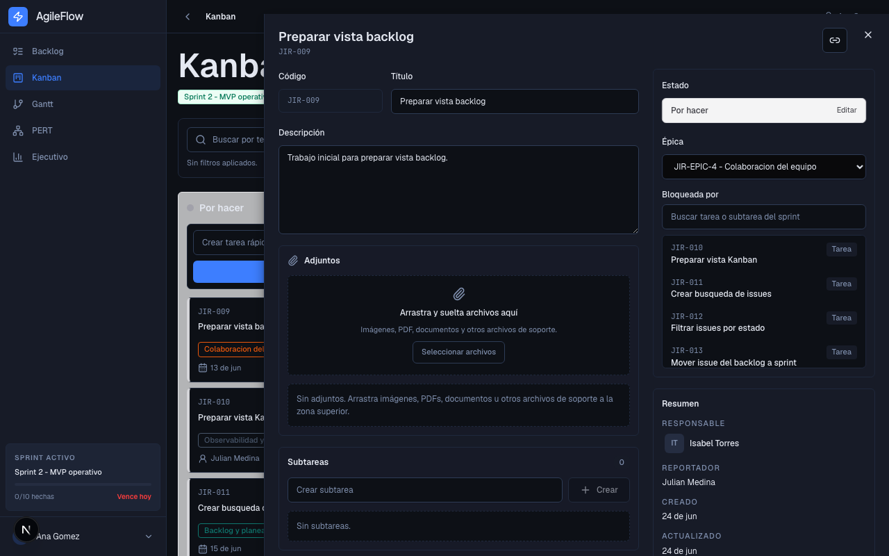
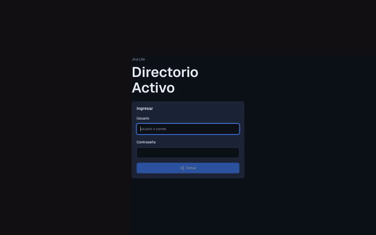
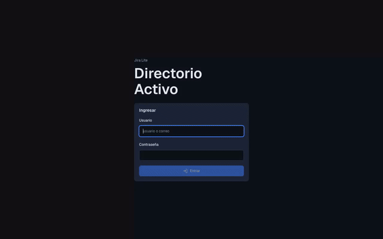
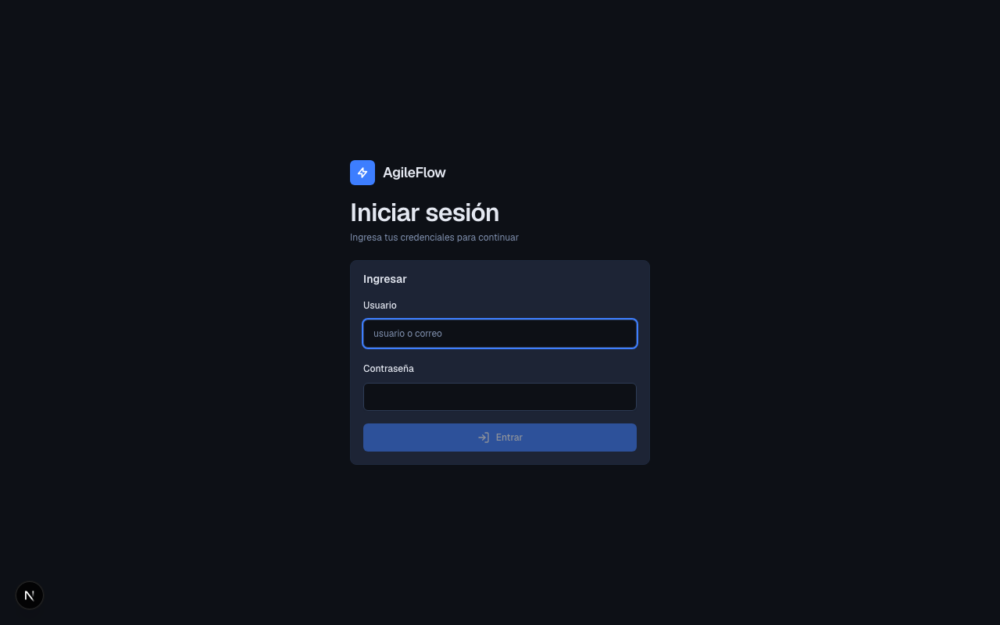
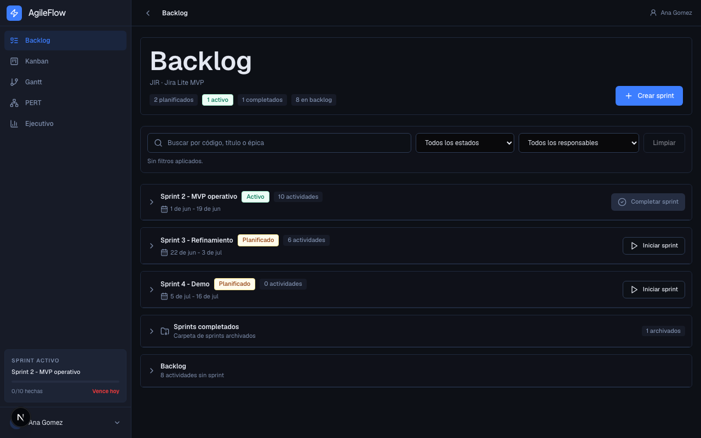
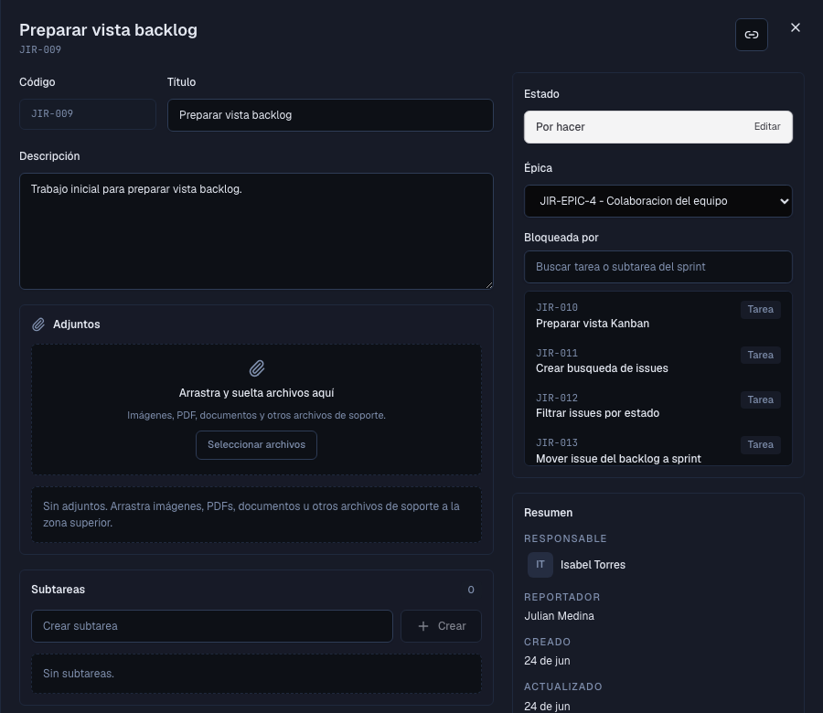
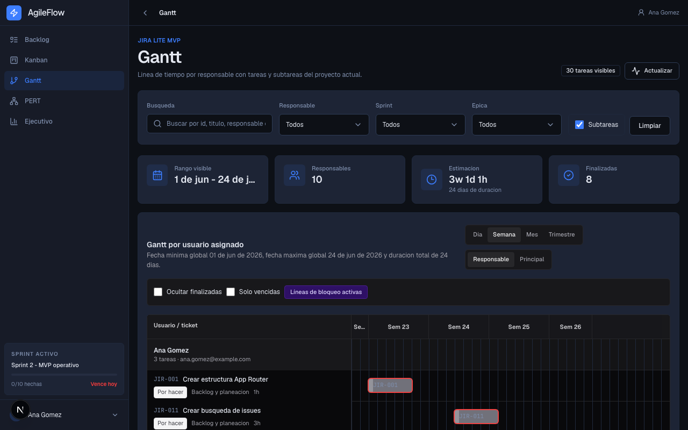
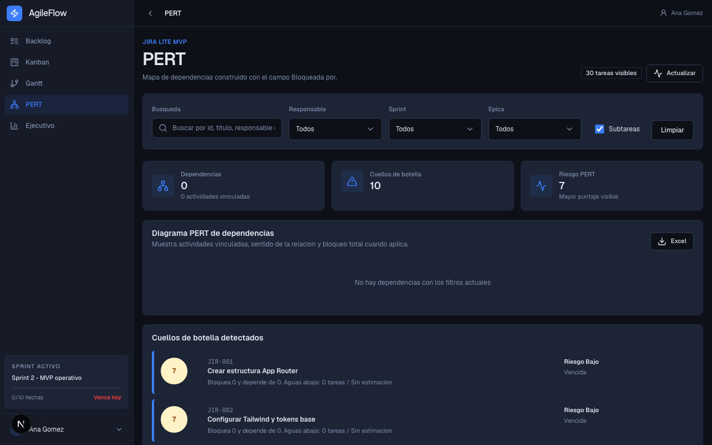
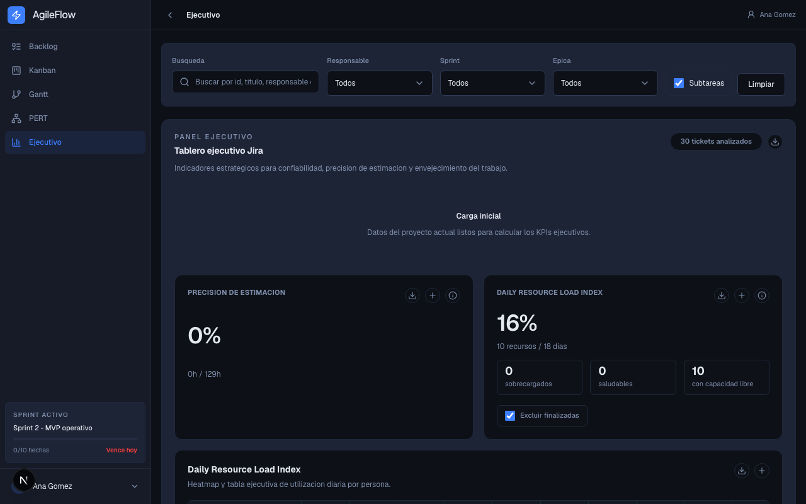

<!-- AgileFlow organiza backlog, sprints, Kanban e indicadores de entrega para equipos de ingenieria que necesitan trabajar rapido sin cargar con la complejidad de Jira. -->
<div align="center">
  

  <h1>AgileFlow</h1>
  <p><strong>Gestion agil self-hosted para planificar, ejecutar y medir sprints sin friccion operativa.</strong></p>

  
  
  
  
  
</div>

---

## 📋 Tabla de Contenidos

- [¿Qué es AgileFlow?](#-qué-es-agileflow)
- [Demo en vivo](#-demo-en-vivo)
- [Características principales](#-características-principales)
- [Capturas de pantalla](#-capturas-de-pantalla)
- [Instalación rápida](#-instalación-rápida)
- [Cómo usar](#-cómo-usar)
- [Arquitectura](#-arquitectura)
- [Roadmap](#-roadmap)
- [Contribuir](#-contribuir)
- [Licencia](#-licencia)

---

## 🎯 ¿Qué es AgileFlow?

AgileFlow es una herramienta de gestion agil para equipos de ingenieria que necesitan backlog, sprints, tablero Kanban, seguimiento de avance y visibilidad ejecutiva en un solo lugar. Esta pensada para equipos que quieren operar con disciplina sin adoptar una plataforma pesada, costosa o dificil de configurar.

El producto se instala en infraestructura propia, conserva la trazabilidad del trabajo y ofrece vistas claras para decidir que priorizar, quien esta cargado y que dependencias pueden bloquear la entrega.

### El problema que resuelve

Muchos equipos pequeños terminan usando herramientas demasiado grandes para su realidad: el tablero se vuelve lento, la configuracion consume tiempo y la informacion de avance queda dispersa entre tickets, reuniones y hojas de calculo.

### La solución

AgileFlow centraliza el flujo diario del equipo: planifica sprints desde el backlog, mueve tareas en Kanban, registra tiempo, visualiza dependencias y convierte el estado del proyecto en indicadores accionables.

### ¿Para quién es?

| Audiencia | Beneficio clave |
|-----------|----------------|
| Equipos de desarrollo de 5 a 25 personas | Gestionan backlog, sprint activo y seguimiento diario sin depender de una suite enterprise. |
| Tech leads y Scrum Masters | Ven capacidad, bloqueos, tareas envejecidas y avance del sprint para tomar decisiones con menos reunion improductiva. |
| Stakeholders y direccion | Consultan una vista ejecutiva con carga, estimaciones, pendientes y señales de riesgo del proyecto. |
| Administradores internos | Operan usuarios locales o LDAP, migracion desde Jira y backups desde una interfaz unica. |

---

## 🎬 Demo en vivo

**Demo web:** [agileflow-indol.vercel.app](https://agileflow-indol.vercel.app)

```text
Usuario: ana.gomez@example.com
Contraseña: password123
```

<div align="center">
  
  <p><em>Flujo principal: crear un sprint, mover tareas desde el backlog y activar el trabajo planificado.</em></p>
</div>

<div align="center">
  
  <p><em>Flujo principal: mover una tarea en Kanban y registrar tiempo desde el panel lateral sin perder contexto.</em></p>
</div>

---

## ✨ Características principales

| Feature | Descripción |
|---------|-------------|
| 🚀 **Backlog y sprints listos para operar** | Crea tareas, organiza epicas, planifica sprints, inicia iteraciones y migra pendientes al cerrar un sprint. |
| 🧭 **Kanban accesible y accionable** | Mueve tareas con mouse, touch o teclado, filtra por texto, epica, etiqueta o responsable y crea tareas rapidas en el sprint activo. |
| 📌 **Detalle de tarea con trazabilidad** | Edita estado, responsable, fechas, estimaciones, subtareas, comentarios, adjuntos, bloqueos y worklogs desde un panel lateral. |
| 📊 **Vistas de planeacion y riesgo** | Usa Gantt, PERT y tablero ejecutivo para entender capacidad, dependencias, carga diaria, envejecimiento y desviaciones de estimacion. |
| 🔐 **Operacion interna segura** | Soporta login local, LDAP/Active Directory, roles admin/user, usuarios activos/inactivos y auditoria de cambios relevantes. |
| 🔄 **Migracion y continuidad** | Incluye migracion desde Jira por JQL, backups manuales o programados, validacion de integridad y restauracion controlada. |

---

## 📸 Capturas de pantalla

### Acceso seguro
<div align="center">
  
  <p><em>Entrada al producto con autenticacion local o directorio corporativo, lista para equipos internos.</em></p>
</div>

### Backlog y planificación de sprints
<div align="center">
  
  <p><em>Organiza el trabajo pendiente, prepara sprints y mantiene visible que esta planificado, activo o en backlog.</em></p>
</div>

### Tablero Kanban con detalle
<div align="center">
  
  <p><em>Ejecuta el sprint activo con columnas claras y un panel de detalle que evita cambiar de pantalla para actualizar una tarea.</em></p>
</div>

### Panel de detalle de tarea
<div align="center">
  
  <p><em>Registra informacion operativa y conserva trazabilidad de cambios, comentarios, adjuntos, subtareas y bloqueos.</em></p>
</div>

### Gantt por responsable
<div align="center">
  
  <p><em>Visualiza fechas, solapamientos y carga por persona para anticipar conflictos de planificacion.</em></p>
</div>

### PERT de dependencias
<div align="center">
  
  <p><em>Detecta bloqueadores, cadenas criticas y tareas que pueden destrabar varias lineas de trabajo.</em></p>
</div>

### Tablero ejecutivo
<div align="center">
  
  <p><em>Resume salud del sprint, carga diaria, pendientes por estimar, desviaciones y tareas envejecidas para decisiones rapidas.</em></p>
</div>

---

## 🚀 Instalación rápida

### Prerrequisitos

- Node.js >= 20
- npm >= 10
- PostgreSQL >= 15
- Git

### Pasos

```bash
# 1. Clonar el repositorio
git clone https://github.com/castellanosfelipe/AgileFlow.git
cd AgileFlow

# 2. Instalar dependencias
npm install

# 3. Configurar variables de entorno
cp .env.example .env.local
# Editar .env.local con DATABASE_URL, NEXTAUTH_URL y NEXTAUTH_SECRET

# 4. Inicializar la base de datos, cargar datos demo y ejecutar
npx prisma migrate deploy
npx prisma db seed
npm run dev
```

✅ Si todo está correcto, verás: `Ready` en la terminal de Next.js y la aplicación disponible en `http://localhost:3000`.

### Alternativa con Docker

```bash
cp .env.example .env
docker compose up --build
```

---

## 💡 Cómo usar

### Caso de uso básico

```text
1. Abre http://localhost:3000
2. Inicia sesión con ana.gomez@example.com / password123
3. Entra al Backlog y revisa los sprints planificados
4. Inicia un sprint
5. Abre Kanban y mueve tareas entre Por hacer, En curso y Finalizada
```

### Casos de uso avanzados

#### Configurar LDAP / Active Directory

```env
LDAP_URL=ldap://tu-servidor:389
LDAP_BIND_DN=CN=service-account,DC=empresa,DC=com
LDAP_BIND_PASSWORD=tu-password
LDAP_BASE_DN=OU=usuarios,DC=empresa,DC=com
LDAP_USER_FILTER=(objectClass=user)
LDAP_LOGIN_ATTRIBUTE=sAMAccountName
LDAP_REQUIRED_GROUP_DN=CN=VPN,CN=Users,DC=empresa,DC=com
```

#### Migrar tickets desde Jira

```text
1. Abre el menu de usuario administrador
2. Selecciona Migracion desde Jira
3. Ingresa URL de Jira, JQL, usuario y token
4. Usa Probar para validar conexion
5. Ejecuta Sincronizar para traer tareas al proyecto actual
```

#### Regenerar documentación visual

```bash
# Con el servidor corriendo y la base seed cargada
node scripts/capture-docs.mjs
```

---

## 🏗️ Arquitectura

AgileFlow usa Next.js como aplicacion full-stack: el frontend vive en App Router, las rutas API resuelven operaciones del producto y Prisma mantiene el modelo de datos en PostgreSQL. La interfaz consume datos con TanStack Query y concentra la experiencia en vistas de backlog, tablero, analitica, administracion y continuidad operativa.

### Stack tecnológico

| Capa | Tecnología | Propósito |
|------|-----------|-----------|
| Frontend | Next.js 15, React 19, Tailwind CSS | Interfaz web, rutas de aplicacion y experiencia responsive. |
| Estado de servidor | TanStack Query v5 | Carga, cache e invalidacion de datos en vistas interactivas. |
| Interaccion Kanban | dnd-kit | Drag and drop con soporte para mouse, touch y teclado. |
| API Backend | Next.js Route Handlers | Endpoints para backlog, tablero, sprints, issues, usuarios, Jira, backups e insights. |
| Base de datos | PostgreSQL + Prisma 6 | Modelo relacional, migraciones, seed y acceso tipado a datos. |
| Autenticación | NextAuth v4, bcryptjs, ldapts | Login local, integracion LDAP/Active Directory y control de sesiones. |
| Validación | Zod | Validacion de formularios, payloads y reglas de negocio. |
| Calidad | TypeScript estricto, Playwright, tests unitarios con tsx | Tipado, pruebas e2e y cobertura de reglas clave de sprint. |
| Despliegue | Docker, Vercel compatible | Ejecucion local, contenedores y despliegues serverless con base externa. |

---

## 🗺️ Roadmap

### ✅ Completado

- [x] Backlog con busqueda, filtros, epicas y sprints planificados/activos/completados.
- [x] Tablero Kanban del sprint activo con drag and drop y soporte de teclado.
- [x] Panel lateral de detalle con subtareas, comentarios, adjuntos, bloqueos, worklogs y auditoria.
- [x] Vistas Gantt, PERT y tablero ejecutivo con metricas de carga, estimacion y envejecimiento.
- [x] Autenticacion local, LDAP/Active Directory, roles admin/user y gestion de usuarios.
- [x] Migracion desde Jira por JQL, sincronizacion, pruebas de conexion y configuracion persistente.
- [x] Backups manuales/programados con historial, descarga, validacion de checksum y restauracion.
- [x] Tema claro/oscuro e idioma español/ingles persistidos con cookies.

### 🔄 En progreso

- [ ] Separar de forma explicita el proveedor de autenticacion por usuario para distinguir cuentas locales y LDAP sin depender del hash interno.
- [ ] Endurecer la experiencia mobile para los flujos densos de tablero, Gantt y ejecutivo.

### 🔮 Próximamente

- [ ] Notificaciones push o integraciones de alerta para cambios relevantes del sprint.
- [ ] Soporte para multiples proyectos dentro de una misma instalacion.
- [ ] Integraciones con GitHub/GitLab para relacionar tareas con ramas, commits y pull requests.
- [ ] API publica REST para automatizaciones externas.

---

## 🤝 Contribuir

Las contribuciones son bienvenidas. Para cambios funcionales, abre primero un issue con el problema, el flujo afectado y el impacto esperado en usuarios finales.

```bash
git clone https://github.com/castellanosfelipe/AgileFlow.git
cd AgileFlow
npm install
npx prisma migrate deploy
npx prisma db seed
npm run typecheck
npm run test:unit
```

Para cambios visuales, actualiza capturas y GIFs con:

```bash
node scripts/capture-docs.mjs
```

---

## 📄 Licencia

MIT — ver [`LICENSE`](./LICENSE) para más detalles.

---

<div align="center">
  <p>Hecho con ❤️ por <a href="https://github.com/castellanosfelipe">castellanosfelipe</a></p>
</div>
